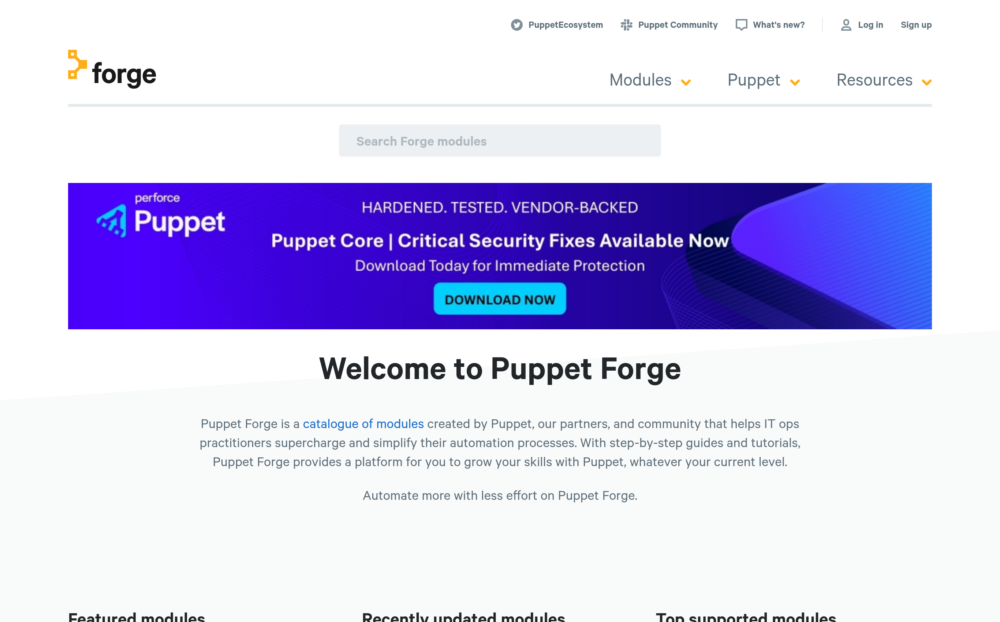
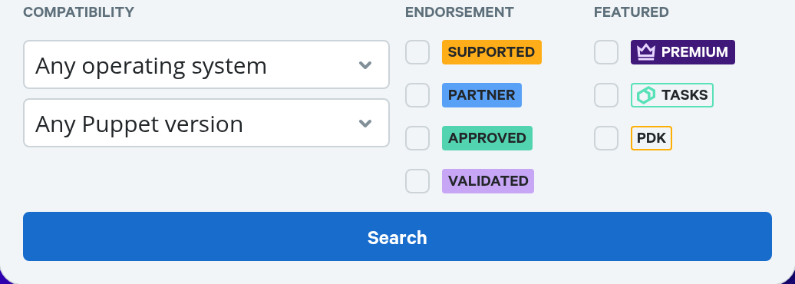
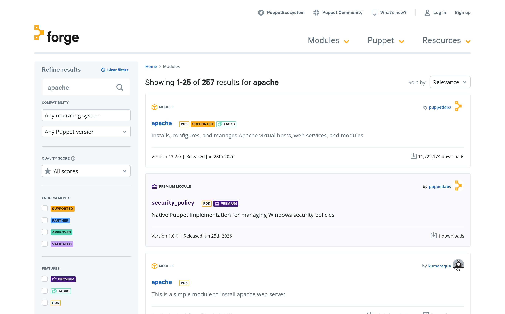
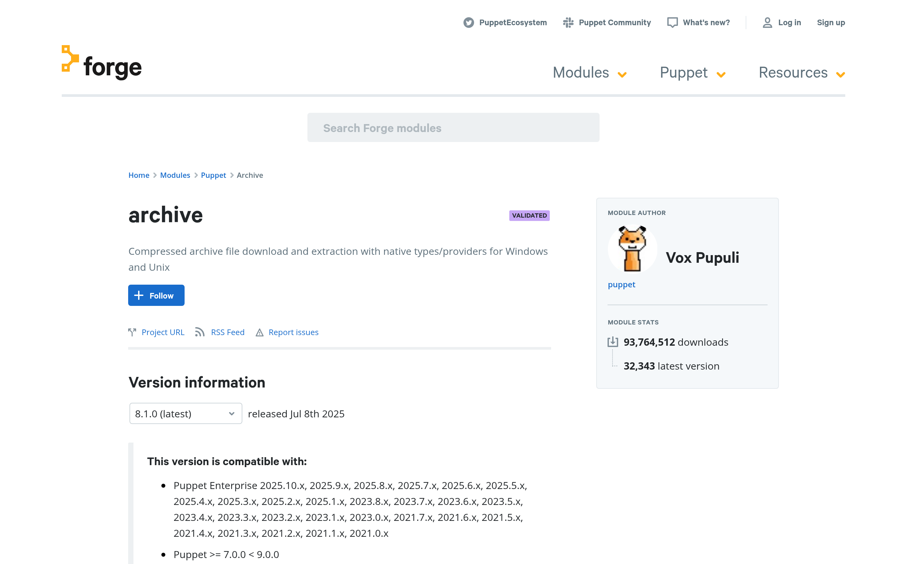
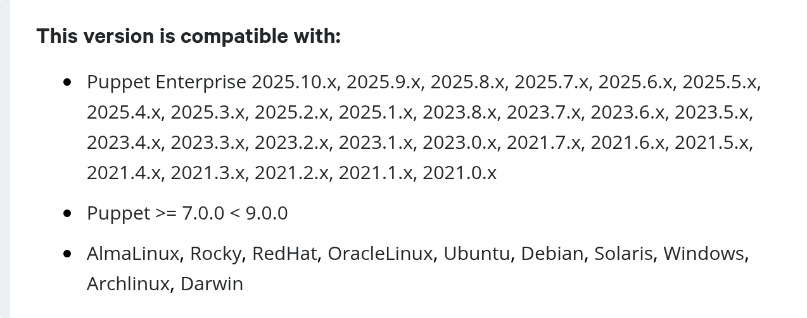

# The Ecosystem

OpenVox is more than a single command. It ships with — and is surrounded by — a
set of tools that you will use constantly. This chapter introduces the most
important ones.

## `facter`

`facter` collects information (*facts*) about a system. The fact-collection
library is called **OpenFact**, the community-maintained successor to Facter; the
command you run is still `facter`.

[OpenFact documentation](https://docs.openvoxproject.org/openfact/latest/index.html)

If you run `facter` with no options, it lists all known facts about the system.

!!! tip "Try it yourself"
    Run `facter` on your machine and skim the output.

    Note that the command is `facter` with an "e", not `factor` with an "o" —
    `factor` is an unrelated math utility that will sit waiting for input.

You can also pass one or more fact names to get just those values. Keys of
structured facts can be retrieved by separating the fact and key names with `.`:

```console
$ facter kernel
Linux
$ facter kernel os.release
kernel => Linux
os.release => {
  full => "7.6.1810",
  major => "7",
  minor => "6"
}
```

!!! tip "Try it yourself"
    Look at the values of various facts, such as `networking`, `os`, and
    `virtual`. Note that while `facter` runs as a regular user, some facts are
    only accessible when it is run as `root`.

## Hiera

Hiera is an external data layer for OpenVox. It can be used for environment-wide
data or inside modules.

Hiera data is stored in layers (a *hierarchy*) where, by default, higher layers
override lower layers. Hiera natively supports YAML and JSON files for data, and
it also supports pluggable backends.

[Hiera introduction](https://docs.openvoxproject.org/openvox/latest/hiera_intro.html)

Hiera is covered in much more depth in
[Logic, Facts, and Hiera](hiera.md).

## `r10k`

`r10k` is a tool for dynamically managing OpenVox environments based on `git`
branches. Each branch of a control repository becomes an environment on disk,
which makes it the cornerstone of a `git`-based deployment workflow.

[r10k on GitHub](https://github.com/puppetlabs/r10k)

You will use `r10k` hands-on in the [exercises](hands-on.md).

## The Puppet Forge

The [Puppet Forge](https://forge.puppet.com/) is the public repository for
Puppet modules, including the OpenVox-maintained modules published under the
`puppet` namespace. OpenVox installs and uses modules from the Forge directly.



From the search box, you can search for module names and technologies.



You can specifically search for **Supported** or **Approved** modules:

* <https://forge.puppet.com/supported>
* <https://forge.puppet.com/approved>

You can also search for modules that include [Tasks](https://docs.openvoxproject.org/openbolt/latest/writing_tasks.html).

Search results can be further filtered and sorted.



When evaluating a module from the search results, pay attention to:

* **Date of the last release.** Modules from before ~2016 are unlikely to follow
  current best practices.
* **Number of downloads.**
* **Quality score.**

The page for each module contains a large amount of information, most of which
comes directly from the module's `metadata.json`. This is the page for the
[`puppet/archive`](https://forge.puppet.com/modules/puppet/archive) module
maintained by Vox Pupuli:



Highlights to look for on a module page:

* The **Project URL** link typically goes to the source (often a GitHub project)
* The **README** typically explains how to use the module
* **Changelog**, **Dependencies**, **Compatibility**, **License**, and scores
* **Tags** from `metadata.json` are used in search
* **Installation** instructions and direct download of current or previous
  versions
* A **compatibility** section lists the supported Puppet versions and operating
  systems



!!! tip "Try it yourself"
    [Explore the Puppet Forge.](https://forge.puppet.com/)
