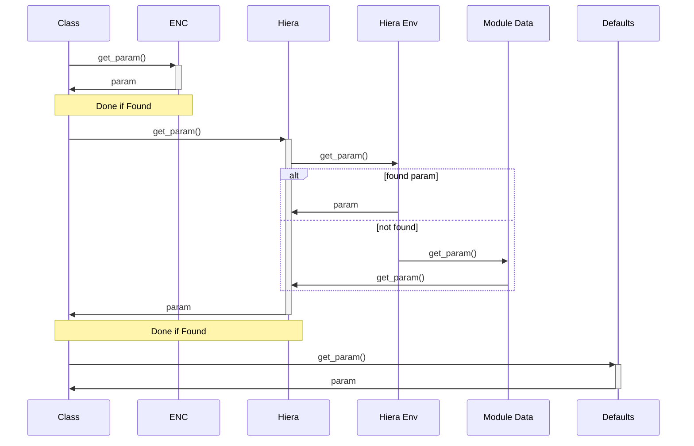

# Logic, Facts, and Hiera

## Introduction to Hiera

Hiera is a key/value lookup tool for configuration data. It provides separation
of data and logic, and it can be accessed from across the Puppet codebase.



Separating business data from logic is mostly about sharing and reuse: it keeps
all sensitive data in a single location and makes values easier to override when
needed.

[Hiera introduction](https://docs.openvoxproject.org/openvox/latest/hiera_intro.html)

## The Hiera configuration file

The file `hiera.yaml` configures a Hiera hierarchy. Hiera looks in three
different locations for `hiera.yaml`:

* **Global Hiera** — `/etc/puppetlabs/puppet/hiera.yaml`
* **Environment Hiera** — `/etc/puppetlabs/code/environments/<environment>/hiera.yaml`
* **Module Hiera** — `hiera.yaml` at the top level of any module

!!! warning
    It is generally recommended to avoid using global Hiera.

The `hierarchy` should contain as many layers as needed to represent your data,
ordered from most specific (at the top) to least specific:

```yaml
---
version: 5

hierarchy:
  - name: "Node-specific data"
    path: "nodes/%{trusted.certname}.yaml"

  - name: "OS/version"
    path: "os/%{facts.os.name}/%{facts.os.release.major}.yaml"

  - name: "OS family"
    path: "os/%{facts.os.family}.yaml"

  - name: "Common data"
    path: "common.yaml"
```

Each `hiera.yaml` must contain a `version` key with the numeric value `5`. It can
optionally contain a `hierarchy` key (defining the locations and order of data
lookups) and a `defaults` key (setting default values for options not explicitly
defined in `hierarchy`).

By default, Hiera data is stored in a directory called `data` in the same
location as `hiera.yaml`. Paths listed in the `hierarchy` are relative to that
`data` directory.

!!! note
    Note the use of `"%{}"` for variable interpolation. In `hiera.yaml`,
    `"%{facts.key}"` is equivalent to `"${facts['key']}"` in Puppet code.

Paths to files in the hierarchy can be specified with `path` (a single file
name) or `paths` (an array of file names). Wildcards can be used with `glob` or
`globs`:

```yaml
---
version: 5

hierarchy:
  - name: "Node-specific data"
    paths:
      - "nodes/%{facts.fqdn}.yaml"
      - "nodes/%{facts.hostname}.yaml"

  - name: "OS family"
    glob: "os/%{facts.os.family}/*.yaml"

  - name: "Common data"
    globs:
      - "common/*.yaml"
      - "common.yaml"
```

Hiera supports multiple backend data sources, but the default is `yaml_data`, a
built-in data source that reads from YAML files.

[Specifying file paths](https://docs.openvoxproject.org/openvox/latest/hiera_config_yaml_5.html#specifying-file-paths) ·
[hiera.yaml v5 reference](https://docs.openvoxproject.org/openvox/latest/hiera_config_yaml_5.html)

## Automatic parameter lookup

OpenVox automatically searches Hiera for any parameters in a class. Any value
found in Hiera overrides the class parameter defaults specified in the `class`
definition.

In the following example, the class `ntp` has a parameter `$servers`:

```puppet
class ntp (
  Array[String] $servers = ['0.pool.ntp.org'],
) { }
```

In Hiera, you can override the default value for `$ntp::servers` by setting the
key `ntp::servers`:

```yaml
---
ntp::servers:
  - 'ntp.internal.net'
```

[Automatic class parameter lookup](https://docs.openvoxproject.org/openvox/latest/hiera_automatic.html#class-parameters)

## Direct parameter lookup

Puppet code can use the `lookup` function to get arbitrary data from Hiera. A
common use is to avoid duplicating a value needed in multiple classes. For
example, you might specify your AD domain controllers in Hiera and use them in
various local profile classes:

```puppet
class myntp (
  Optional[Array[String]] $servers = lookup('dc'),
) { }
```

```yaml
---
dc:
  - 'dc1.mydomain.local'
  - 'dc2.mydomain.local'
```

!!! note
    The `lookup` function can be used in Puppet code, in parameter declarations,
    and in Hiera. Generally, `lookup` in Puppet code should be avoided, as it
    ties your code to Hiera and can limit reuse through direct resource-style
    `class` statements. Using `lookup` in class parameter declarations, however,
    does *not* sacrifice this flexibility, because the return values are simply
    used as parameter defaults.

[lookup](https://docs.openvoxproject.org/openvox/latest/hiera_automatic.html#puppet-lookup)

## Lookup options

The `lookup` function can be called with additional options:

```text
lookup(name, value_type, merge_behavior, default_value)
```

A more flexible way to call `lookup` is to use an options hash:

```text
lookup(name, { options hash })
```

The most commonly used keys of the options hash are `name`, `value_type`,
`merge`, and `default_value` — which correspond to the ordered arguments above.

* **`name`** is the key to look up in Hiera. It is required, but it can be
  specified *either* as the first argument to `lookup` *or* in the options hash.
* **`value_type`** is a data type that `lookup` should return (such as `String`,
  `Array`, or `Hash`). If not specified, `lookup` accepts any returned type.
* **`merge`** specifies the merge behavior (see below).
* **`default_value`** is returned if the key is not found.

### Merge behavior

`merge` accepts any of the following values:

* `first` or `{ 'strategy' => 'first' }` (the default)
* `unique` or `{ 'strategy' => 'unique' }`
* `hash` or `{ 'strategy' => 'hash' }`
* `deep` or `{ 'strategy' => 'deep' }`

#### `first`

The default. Stops at the first value found and returns it. Given the following
data (from most specific to least specific):

```yaml
mykey:
  - 'a'
```

```yaml
mykey:
  - 'b'
```

`lookup('mykey', {'merge' => 'first'})` returns `['a']`.

#### `unique`

Combines all values found into an array with all duplicate values removed. Given:

```yaml
mykey:
  - 'a'
  - 'b'
```

```yaml
mykey:
  - 'b'
  - 'c'
```

`lookup('mykey', {'merge' => 'unique'})` returns `['a', 'b', 'c']`.

#### `hash`

Requires that the search key returns one or more hashes, and combines all hashes
found, with keys at higher layers taking precedence over keys at lower layers.
Given:

```yaml
mykey:
  key1:
    topkey: topvalue
```

```yaml
mykey:
  key1:
    topkey: differentvalue
    otherkey: othervalue
  key2:
    key: value
```

`lookup('mykey', {'merge' => 'hash'})` returns
`{ 'key1' => { 'topkey' => 'topvalue' }, 'key2' => { 'key' => 'value' } }`.

#### `deep`

Works like `hash`, except it continues to merge hash or array values found at
lower layers. Given the same data as above,
`lookup('mykey', {'merge' => 'deep'})` returns
`{ 'key1' => { 'topkey' => 'topvalue', 'otherkey' => 'othervalue' }, 'key2' => { 'key' => 'value' } }`.

If `merge` is specified as `{'strategy' => 'deep'}`, other options can be
included in that hash:

* `knockout_prefix` — sets a string that tells Hiera to remove a value
* `sort_merged_arrays` — tells Hiera to sort the values of merged arrays
* `merge_hash_arrays` — enables more complex behavior around merging arrays of
  hashes

All of these are disabled by default.

[Hiera merging](https://docs.openvoxproject.org/openvox/latest/hiera_merging.html)

### `lookup_options` in Hiera

The options hash for `lookup` can also be provided *in Hiera* using the
`lookup_options` key. Hiera automatically searches for `lookup_options` in all
hierarchies (global, environment, and module) and performs a deep merge of the
results. This is especially useful for influencing automatic parameter lookup,
where `lookup` is not called explicitly.

`lookup_options` can be specified for individual keys or using regular
expressions:

```yaml
lookup_options:
  'ntp::servers':
    merge: unique
  '^ntp::.*$':
    merge: deep
```

This turns on `unique` merge behavior for the key `ntp::servers`, but enables
`deep` merge behavior for all other keys under the `ntp::` scope.

!!! info
    `lookup_options` is a reserved key in Hiera.

[Merging and lookup_options](https://docs.openvoxproject.org/openvox/latest/hiera_merging.html)
