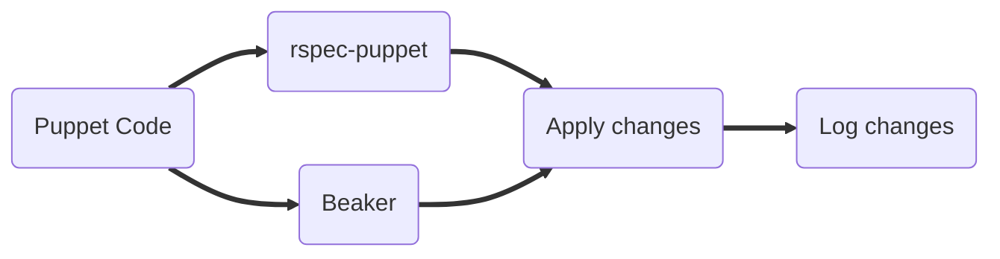
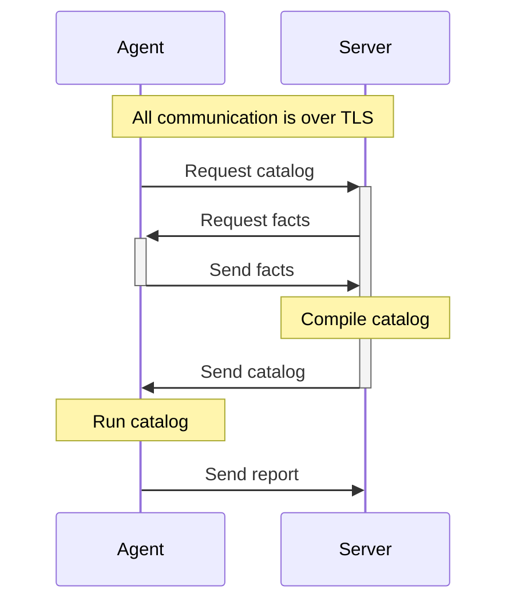

# Puppet Overview

## Introduction

### What is OpenVox?

OpenVox is the open source implementation of the Puppet configuration management
platform. At its core it is:

* A system automation tool
* A (mostly) declarative language
* A way to ensure your configuration stays the same — it re-applies your desired
  state on a regular schedule (every 30 minutes by default), which makes
  configuration *self-healing*
    * This is particularly important for compliance
* Backed by a vibrant open source community

One of the things that makes the Puppet language unusual is that Operations,
Development, and Security teams have all consistently been able to read and
understand it.

### Why use it?

* **Scalable:** Allows every system administrator to manage more
* **Readable:** Code as documentation — reading the code is descriptive
* **Automated:** Don't repeat work, have work repeat itself
* **Extendable:** Use existing code for common components

## Infrastructure as Code

### Enables programmable infrastructure

* Documentation as code
* Repeatable management
* Self-healing configurations
* The description of a machine is enforced automatically — not by hand

### Easier than traditional methods

* Encourages healthy IT habits
* Faster and less risky than manual configuration
* Less documentation than scripting, and easier to maintain
* Less overhead than maintaining golden images
* Extremely mature automated test frameworks

Traditional scripting requires a *lot* of documentation, which takes time both
to write and to read — and it often still isn't effective enough. Documentation
is always important, but it is easier to see what is happening with Puppet code:
even if your team doesn't fully understand a tool, they can get a high-level view
of which pieces of a machine the tool touches.

Golden images, by contrast, require a new image to be built and maintained for
every change. That is a huge amount of data to store, and small changes take a
long time to implement. Manual changes are not only slow but risky — humans are
not as good at tedious, repetitive tasks as computers are. Let OpenVox automate
the task as you describe it.

## The Puppet model

The Puppet model maps neatly onto DevOps best practices:

* **Describe** your systems with manifests (Puppet code)
* **Simulate** and **test** with tools like `rspec-puppet` and Beaker
* **Enforce** the desired state by applying the catalog during a run
* **Report** changes back to the server, then repeat

!!! info
    OpenVox only manages the resources that it is explicitly told to manage.
    It will not touch anything you haven't described.

## The Puppet DSL

* A Ruby-based Domain Specific Language (DSL)
* A declarative language
    * You define the end state, not (necessarily) the steps to get there
* Properly developed Puppet code should be *idempotent*
    * Repeated application should result in no changes (and minimal work)

Declarative means you should think of it more like `make` than like a scripting
language such as Perl or Ruby.

## Key terms

You will see these terms used throughout the course.

### Nodes

A *node* is a system managed by OpenVox.

[Glossary: node](https://docs.openvoxproject.org/openvox/latest/glossary.html#node)

### Manifests

A *manifest* is simply a file containing Puppet code. Puppet manifests typically
have the extension `.pp`.

[Glossary: manifest](https://docs.openvoxproject.org/openvox/latest/glossary.html#manifest)

### Resources

A *resource* is a single unit of managed configuration.

[Language: Resources](https://docs.openvoxproject.org/openvox/latest/lang_resources.html)

### Attributes

Resource *attributes* are used to describe the desired state of a resource.
Attributes are also commonly referred to as *parameters* or *properties*.

[Language: Resource attributes](https://docs.openvoxproject.org/openvox/latest/lang_resources.html#attributes)

### Classes

A *class* is used to organize Puppet code. An External Node Classifier (ENC) can
be used to apply classes to systems manually or based on any arbitrary data.

[Language: Classes](https://docs.openvoxproject.org/openvox/latest/lang_classes.html)

### Modules

A *module* is a bundle of Puppet code and data.

[Module fundamentals](https://docs.openvoxproject.org/openvox/latest/modules_fundamentals.html)

### Environments

*Environments* are used to isolate Puppet code on a system. Each environment
corresponds to a separate directory under
`/etc/puppetlabs/code/environments`.

[About environments](https://docs.openvoxproject.org/openvox/latest/environments_about.html)

## The Puppet run lifecycle

In a standard server/agent configuration, the agent connects to the server to
request a catalog. Facts are collected on the agent and sent to the server. The
server compiles a catalog and sends it back to the agent. The agent then applies
the catalog, and when it is done it sends a report back to the server.

!!! info
    Compiling on the server provides better node isolation, data security, and
    authoritative environment control. OpenVox uses its own Certificate
    Authority (CA) to secure agent/server communication.
