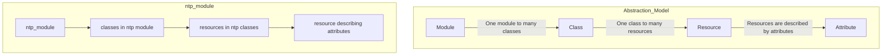

# Core Resources

A *resource* is a single piece of state managed by OpenVox.

A file resource named `hello_world`:

```puppet
file { 'hello_world': }
```

A very common resource pattern — install a package, create a configuration file,
and restart a service when that file changes:

```puppet
package {'ntp':} -> file {'/etc/ntp.conf':} ~> service {'ntpd':}
```

[Resource type reference](https://docs.openvoxproject.org/openvox/latest/type.html)

## Abstraction

Resources are the bottom layer of an abstraction model that runs from modules
down to individual attributes:



## Resource syntax

```puppet
resource-type { 'resource name':
  parameter => 'String value',
  parameter => [
    'Array value',
    'another value',
  ],
  parameter => {
    'Hash key' => 'Hash value',
  },
}
```

!!! warning
    A given resource — the combination of *resource-type* and *resource name* —
    can only be defined once in a compiled catalog.

## `file`

File resources manage files, directories, and symlinks on the filesystem.

Use `ensure => file` to manage files:

```puppet
file { '/etc/resolv.conf':
  ensure  => file,
  owner   => 'root',
  group   => 'root',
  mode    => '0644',
  content => 'search example.com
nameserver 8.8.8.8',
}
```

Use `ensure => directory` to manage directories:

```puppet
file { '/etc/facter':
  ensure => directory,
  owner  => 'root',
  group  => 'root',
  mode   => '0755',
}
```

Use `ensure => link` to manage symbolic links:

```puppet
file { '/etc/localtime':
  ensure => link,
  target => '/usr/share/zoneinfo/US/Pacific',
}
```

[file resource type](https://docs.openvoxproject.org/openvox/latest/types/file.html)

## `package`

Installs or removes packages using the system's default package manager.

```puppet
package { 'vim':
  ensure => installed,
}

package { 'emacs':
  ensure => absent,
}
```

[package resource type](https://docs.openvoxproject.org/openvox/latest/types/package.html)

## `service`

Manages services. `ensure` manages the running state of the service; `enable`
manages whether it starts on boot.

```puppet
service { 'sshd':
  ensure => running,
  enable => true,
}

service { 'xinetd':
  ensure => stopped,
  enable => false,
}
```

[service resource type](https://docs.openvoxproject.org/openvox/latest/types/service.html)

## `group`

Group resources manage groups.

```puppet
group { 'mysql':
  ensure => present,
  gid    => '27',
}
```

[group resource type](https://docs.openvoxproject.org/openvox/latest/types/group.html)

## `user`

User resources manage users.

```puppet
user { 'mysql':
  ensure     => present,
  comment    => 'MySQL Server',
  uid        => '27',
  gid        => 'mysql',
  home       => '/var/lib/mysql',
  managehome => false,
  shell      => '/sbin/nologin',
}
```

Listing groups in `gid` (the user's primary group) or `groups` (the user's
supplemental groups) automatically creates dependencies on those group
resources, if they exist.

[user resource type](https://docs.openvoxproject.org/openvox/latest/types/user.html)

## `notify`

Logs a message on the agent node.

```puppet
notify { 'This is a non-fatal message.': }
```

[notify resource type](https://docs.openvoxproject.org/openvox/latest/types/notify.html)

## Relationships and ordering

By default, resources are applied in the order they are declared in a manifest.
OpenVox also supplies metaparameters to control ordering and dependent
relationships explicitly.

[Relationships and ordering](https://docs.openvoxproject.org/openvox/latest/lang_relationships.html)

### `require` and `before`

In this example, the configuration file requires that the package be installed:

```puppet
package { 'ntp':
  ensure => present,
}

file { '/etc/ntp.conf':
  ensure  => file,
  require => Package['ntp'],
}
```

In this equivalent example, the package must be installed before the
configuration file:

```puppet
package { 'ntp':
  ensure => present,
  before => File['/etc/ntp.conf'],
}

file { '/etc/ntp.conf':
  ensure => file,
}
```

The `Package[...]` and `File[...]` used above are *resource references*.

[Resource references](https://docs.openvoxproject.org/openvox/latest/lang_data_resource_reference.html)

### `subscribe` and `notify`

In this example, the service requires the configuration file to exist and will
refresh (restart) if the file changes:

```puppet
file { '/etc/ntp.conf':
  ensure => file,
}

service { 'ntpd':
  ensure    => running,
  enable    => true,
  subscribe => File['/etc/ntp.conf'],
}
```

In this equivalent example, the relationship is declared in the opposite
direction:

```puppet
file { '/etc/ntp.conf':
  ensure => file,
  notify => Service['ntpd'],
}

service { 'ntpd':
  ensure => running,
  enable => true,
}
```

[Refreshing and notification](https://docs.openvoxproject.org/openvox/latest/lang_relationships.html#refreshing-and-notification)

### Chaining

Chaining arrows are shorthand for the relationship metaparameters:

* `->` is equivalent to `before`
* `~>` is equivalent to `notify`

A common pattern chains `package`, configuration `file`, and `service`
resources:

```puppet
package {'ntp':} -> file {'/etc/ntp.conf':} ~> service {'ntpd':}
```

[Chaining arrows](https://docs.openvoxproject.org/openvox/latest/lang_relationships.html#syntax-chaining-arrows)

## `exec`

`exec` is used to run arbitrary commands.

```puppet
file { ['/etc/facter','/etc/facter/facts.d']:
  ensure => directory,
  mode   => '0755',
}

file { '/etc/facter/facts.d/lastrun':
  content => '#!/bin/bash
stat -c "lastrun=%Y" "$0"',
  mode    => '0755',
}

exec { 'touch /etc/facter/facts.d/lastrun':
  path => '/bin:/usr/bin',
}
```

This example creates an external fact `lastrun` that gives the time of the last
OpenVox run (in seconds since the epoch).

!!! tip "Try it yourself"
    Save the manifest above in a file and use `puppet apply` *as root* to apply
    it. Examine the output of repeated `puppet apply` runs and the value of
    `facter lastrun`.

!!! warning
    The `touch` command above executes on **every** run. For many reasons,
    `exec` should be avoided when possible — and when it is necessary, `exec`
    resources should **always** be constrained with one of the parameters below.

[exec resource type](https://docs.openvoxproject.org/openvox/latest/types/exec.html)

### `creates`

Commands that create files can be set to run only once by specifying the created
file with `creates`. The `exec` runs only if the file named by `creates` does
not exist.

```puppet
exec { 'touch /tmp/runonce':
  path    => '/bin:/usr/bin',
  creates => '/tmp/runonce',
}
```

!!! tip "Try it yourself"
    Save the manifest above and apply it with `puppet apply`. Examine the output
    of repeated runs.

### `onlyif` and `unless`

`onlyif` and `unless` test the return value of a command to decide whether to
execute an `exec` resource. The following are equivalent:

```puppet
exec { '/usr/local/bin/somescript':
  onlyif => '/bin/test -x /usr/local/bin/somescript',
}

exec { '/usr/local/bin/somescript':
  unless => '/bin/test ! -x /usr/local/bin/somescript',
}
```

### `refreshonly`

Only run the `exec` on a `subscribe` or `notify` event. For example, the
following runs `newaliases` when `/etc/aliases` is updated (assuming
`/etc/aliases` is declared as a `file` resource):

```puppet
exec { '/usr/bin/newaliases':
  refreshonly => true,
  subscribe   => File['/etc/aliases'],
}
```

## Other core resources

These are part of the resource abstraction layer but are not commonly used:

* [`filebucket`](https://docs.openvoxproject.org/openvox/latest/types/filebucket.html) configures backup locations for OpenVox-modified files
* The [`resources`](https://docs.openvoxproject.org/openvox/latest/types/resources.html) meta-resource controls the behavior of other resources
* [`schedule`](https://docs.openvoxproject.org/openvox/latest/types/schedule.html) controls when a manifest will apply
* [`stage`](https://docs.openvoxproject.org/openvox/latest/types/stage.html) can order the application of classes
* [`tidy`](https://docs.openvoxproject.org/openvox/latest/types/tidy.html) cleans up files, similar to `tmpwatch`

[Resource type reference](https://docs.openvoxproject.org/openvox/latest/type.html)
